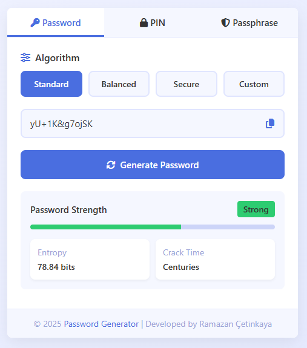
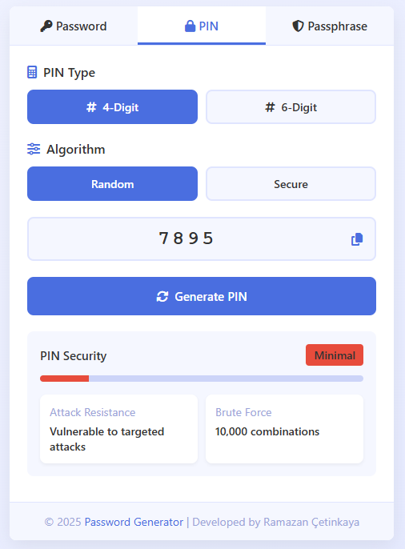
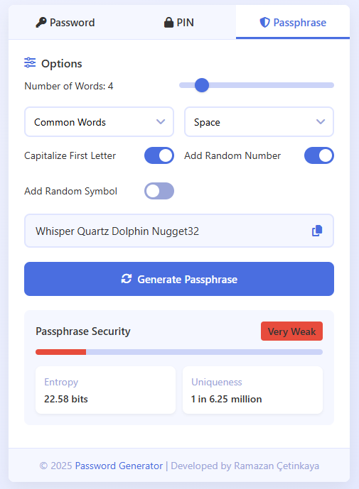

# Password Generator

[](LICENSE)
[](https://github.com/ramazancetinkaya/password-generator/issues)
[](https://github.com/ramazancetinkaya/password-generator/stargazers)
[](https://github.com/ramazancetinkaya/password-generator/network)

A modern, secure, and feature-rich password generator built with HTML, CSS, and vanilla JavaScript. This application helps users create strong passwords, PINs, and passphrases with various security options.

## Features

### Password Generation
- **Multiple Algorithms**:
  - Standard (12 characters)
  - Balanced (16 characters)
  - Secure (24 characters with cryptographic strength)
  - Custom settings
- **Customization Options**:
  - Length control (8-64 characters)
  - Character types (uppercase, lowercase, numbers, symbols)
  - Exclude similar characters (i, l, 1, o, 0)
  - Exclude ambiguous symbols ({}, [], (), /)
- **Security Metrics**:
  - Entropy calculation
  - Estimated crack time

### PIN Generation
- Support for both 4-digit and 6-digit PINs
- Two security algorithms:
  - Random generation
  - Secure (avoids common patterns and sequential numbers)
- Security metrics:
  - Attack resistance information
  - Brute force combinations

### Passphrase Generation
- Word count selection (3-12 words)
- Multiple word lists:
  - Common Words
  - EFF Wordlist
  - Diceware
  - BIP39 Words
- Customization options:
  - 10 different separators
  - Capitalize first letter
  - Add random number
  - Add random symbol
- Security metrics:
  - Entropy calculation
  - Uniqueness probability

### User Experience
- Responsive design for all devices (desktop, tablet, mobile)
- Clean, modern user interface
- Copy to clipboard functionality
- Real-time security strength indicators
- Toast notifications for user feedback

## Screenshots

<div align="center">
  
  <p><em>Password Generation Tab</em></p>
</div>

<div align="center">
  
  <p><em>PIN Generation Tab</em></p>
</div>

<div align="center">
  
  <p><em>Passphrase Generation Tab</em></p>
</div>

## Demo

Experience the application instantly via GitHub Pages:

[](https://ramazancetinkaya.github.io/password-generator/)

## Technology Stack

- HTML5
- CSS3
- Vanilla JavaScript
- Font Awesome for icons
- No external libraries or frameworks

## Security Information

This application generates passwords using cryptographically secure methods:
- Secure random algorithm uses `window.crypto.getRandomValues()`
- Entropy calculations based on character set and length
- Crack time estimates considering modern computing capabilities (10 trillion guesses/second)

The application runs entirely in the browser with no server communication. All processing happens locally, ensuring your passwords never leave your device.

## Installation

### Option 1: Clone the Repository

```bash
git clone https://github.com/ramazancetinkaya/password-generator.git
cd password-generator
```

### Option 2: Download as ZIP

1. Go to the [repository page](https://github.com/ramazancetinkaya/password-generator)
2. Click the "Code" button
3. Select "Download ZIP"
4. Extract the ZIP file to your desired location

## Usage

Simply open the `index.html` file in any modern web browser to start using the application. No server or additional dependencies are required.

### Password Generation

1. Select the "Password" tab
2. Choose an algorithm (Standard, Balanced, Secure, or Custom)
3. Adjust any custom settings if needed
4. Click "Generate Password"
5. Use the copy button to copy the password to your clipboard

### PIN Generation

1. Select the "PIN" tab
2. Choose between 4-digit or 6-digit PIN
3. Select an algorithm (Random or Secure)
4. Click "Generate PIN"
5. Copy the PIN using the copy button

### Passphrase Generation

1. Select the "Passphrase" tab
2. Choose the number of words (3-12)
3. Select a word list and separator
4. Enable/disable additional options (capitalization, numbers, symbols)
5. Click "Generate Passphrase"
6. Copy the passphrase using the copy button

## Browser Compatibility

Tested and working on:
- Chrome (latest)
- Firefox (latest)
- Safari (latest)
- Edge (latest)
- Opera (latest)
- Mobile browsers

## Contributing

Contributions are welcome! Please feel free to submit a pull request or open an issue for any enhancements or bug fixes.

## License

This project is licensed under the MIT License. See the [LICENSE](LICENSE) file for more details.

## Author

Designed and developed by **Ramazan Çetinkaya**.

## Contact

For any inquiries, please contact:

- GitHub: [ramazancetinkaya](https://github.com/ramazancetinkaya)
- Email: [ramazancetinkayasoftworks@protonmail.com](mailto:ramazancetinkayasoftworks@protonmail.com)
