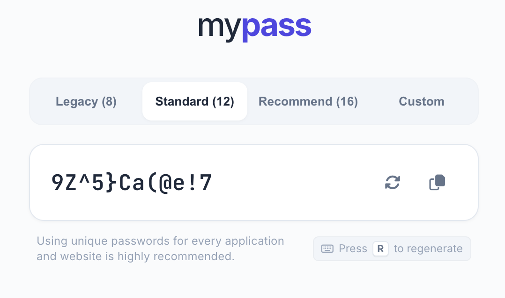
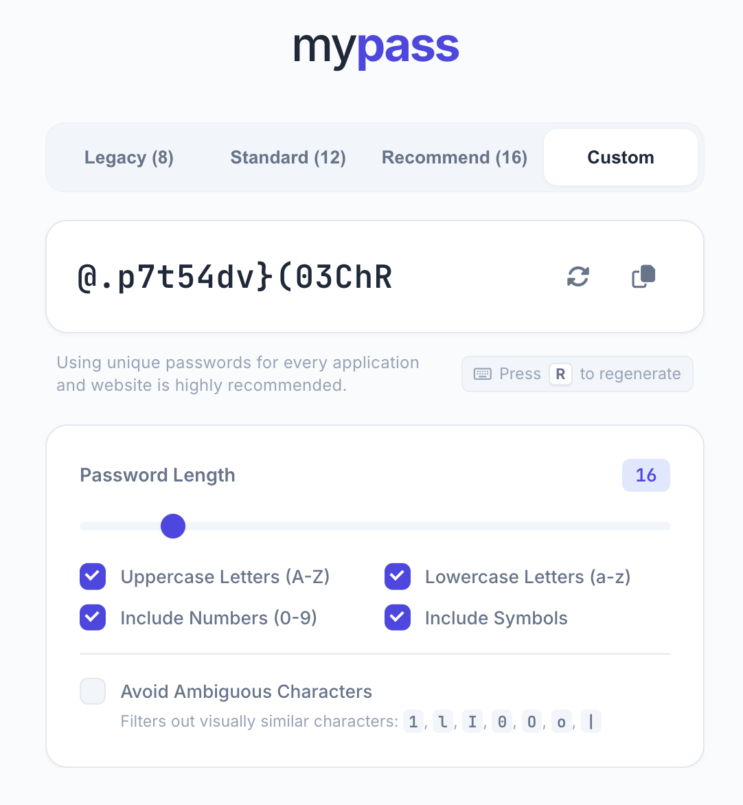

[](LICENSE)
[](https://github.com/ramazancetinkaya/password-generator/issues)
[](https://github.com/ramazancetinkaya/password-generator/stargazers)
[](https://github.com/ramazancetinkaya/password-generator/network)

# mypass - a Password Generator

A modern, lightweight, and cryptographically secure password generator web application built with vanilla HTML5, CSS3, and vanilla JavaScript.

## Demo

Experience the application instantly via GitHub Pages:

[](https://ramazancetinkaya.github.io/password-generator/)

## Features

### Interface Features

- Fluid Drag-Scroll: Enables smooth touch-swipe or mouse-drag horizontal navigation inside the password display container for long strings.

- Quick Hotkeys: Instantly regenerates a new password on demand with a simple tap of the R key.

- Fully Responsive: Dynamically optimized to adapt seamlessly across all mobile, tablet, and desktop viewports.

### Algorithm Features

- Cryptographic Security: Enforces high-entropy generation via the Web Crypto API (window.crypto.getRandomValues) instead of insecure Math.random().

- Zero-Repetition Presets: Guarantees 100% unique character structures (repetition limit = 1) across Legacy (8), Standard (12), and Recommend (16) presets.

- Heuristic Protections: Actively blocks spatial QWERTY keyboard adjacencies and consecutive character-type clustering (e.g. three symbols in a row).

- Dynamic Custom Scaling: For Custom mode (8-64 chars), character repetitions are mathematically capped at $\lceil \text{Length} / \text{Pool Size} \rceil$, combined with sequential de-duplication to prevent repeating pairs (e.g., aa, 99).

## How It Works Under the Hood

1. Legacy Alphanumeric System

    Implements a strict alphanumeric generator. The layout is actively supervised by a Predictability Controller that logs pattern histories. If a pattern match exceeds 60% similarity over the past 5 generations or a digit occupies the first index, it forces a transition to a strict alternating structure to eliminate predictable character clusters.

2. Standard Clump Prevention

    Utilizes a multi-pass heuristic loop to evaluate spatial proximity on standard QWERTY keyboards. If adjacent keystrokes or repetitive character-type clumping (e.g., three consecutive digits or lowercase letters) are detected, the generator instantly executes a secure re-shuffle. If constraints fail to resolve after 150 passes, a deterministic shift-matrix aligns characters homogeneously.

3. Recommend Mask Attack Shield

    Counteracts structural dictionary and mask attacks by analyzing sequence density. If the character sequence mimics predictable patterns or clusters too many numbers/symbols near the borders, the system dynamically disperses complex tokens directly to outer boundaries and center nodes.

4. Refined Symbol Sets

    To prevent SQL injection, shell command execution, and string literal escape issues, both the safe and extended symbol sets are strictly sanitized. High-risk characters such as backslashes (\), single quotes ('), double quotes ("), and backticks (`) are completely omitted.


## Screenshots

<div align="center">
  
  <p><em>Password Generator Standard Tab</em></p>
</div>

<div align="center">
  
  <p><em>Password Generator Custom Tab</em></p>
</div>

## Installation

There are two methods to get this project up and running on your local machine.

### Prerequisites

- A modern web browser (Chrome, Edge, Firefox, Safari, etc.)
- Download [Git](https://git-scm.com/) *(optional, if you choose to clone the repository)*

### 1. Clone the Repository

If you have Git installed, you can clone the repository by following these steps:

1. Open your **terminal** or **command prompt**.

2. Run the following command:
   
    ```bash
    git clone https://github.com/ramazancetinkaya/password-generator.git
    ```

4. Navigate into the project directory:

    ```bash
    cd password-generator
    ```

### 2. Download as ZIP

If you prefer not to use Git, you can download the project as a ZIP file:

1. Go to the GitHub repository page in your web browser.
2. Click the green **"Code"** button at the top right of the repository's file list.
3. Select **"Download ZIP"** from the dropdown menu.
4. Once the ZIP file is downloaded, extract it to your desired location.

## Usage

This is a standard frontend project, so you can run it directly in your web browser without any complex setup or server configuration:

1. Open the project folder on your computer.
2. Locate the `index.html` file.
3. **Double-click** the `index.html` file to launch it in your default web browser.

*Alternative Method:* You can also drag and drop the `index.html` file directly into any open browser tab (Chrome, Firefox, Safari, Edge, etc.).

## Browser Compatibility

Tested and working on:
- Chrome (latest)
- Edge (latest)
- Firefox (latest)
- Safari (latest)
- Mobile browsers (iOS Safari, Android Chrome)

## Contributing

Contributions are welcome! Please feel free to submit a pull request or open an issue for any enhancements or bug fixes.

## License

This project is licensed under the MIT License. See the [LICENSE](LICENSE) file for more details.

## Contact

Whether you need to report an issue, propose a new feature, require setup and integration guidance, or submit a security disclosure, please reach out directly:

📧 **Contact Email**: `ramazancetinkayasolutions@protonmail.com`
